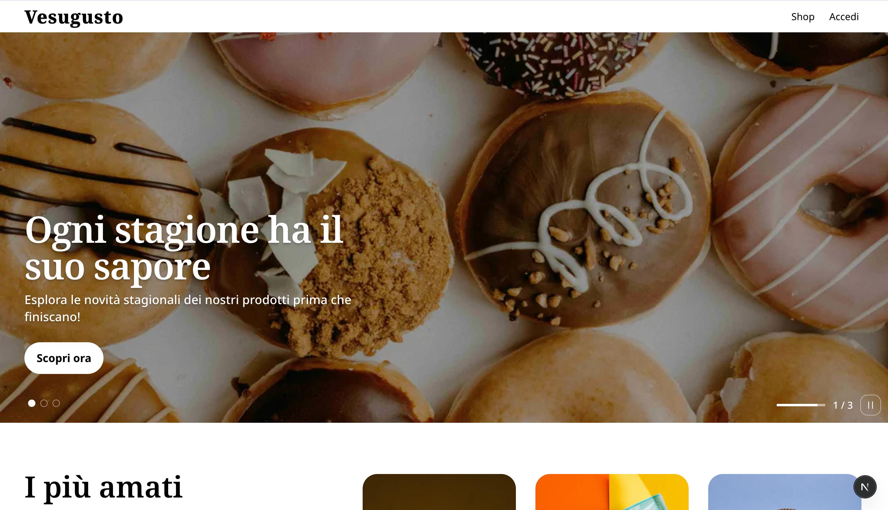

# Applicazione web full stack in Next.js

[Vesugusto](https://www.vesugusto.dev) è un progetto full stack, sviluppato con [Next.js](https://nextjs.org)(`React framework`), e concepito come e-commerce per la vendita di prodotti tipici vesuviani. Integra sistema di autenticazione, una sezione shop moderna e tutte le funzionalità tipiche di un e-commerce professionale.

## Funzionalità principali

- **Interfaccia moderna, responsive e completamente accessibile** sviluppata con [React](https://react.dev/) e [Tailwind CSS](https://tailwindcss.com/), perfetta su qualsiasi dispositivo.
- **Sistema di autenticazione** **`OAuth`** integrato tramite [Clerk](https://clerk.com/).
- **Backend API** con [Supabase](https://supabase.com/) per contenuti dinamici e operazioni CRUD atomiche.
- E-commerce completo con:
  - Possibilità di **ricercare**, **filtrare** e **ordinare** i prodotti.
  - **Paginazione** integrata per una navigazione ottimale.
  - Schede prodotto dettagliate.
  - Carrello.
  - Checkout con integrazione ai **pagamenti** tramite [Stripe Checkout](https://stripe.com/it/payments/checkout) e con **webhook endpoint** per finalizzare l'ordine.
  - Area utente.
- Versione **light** e **dark** basata sulle preferenze del dispositivo.
- **Invio automatico di email** di benvenuto e di conferma degli ordini tramite [Resend](https://resend.com/).
- **Notifiche** di interazione tramite toast personalizzati integrati con [react-hot-toast](https://react-hot-toast.com/).
- **Animazioni** fluide grazie a [Motion](https://motion.dev/) ed [Embla](https://www.embla-carousel.com/).
- **Sistema di routing e gestione delle pagine** dinamico e scalabile con Next.js.
- **Ottimizzazione di immagini, SEO e performance** grazie alle funzionalità avanzate di Next.js 16!
